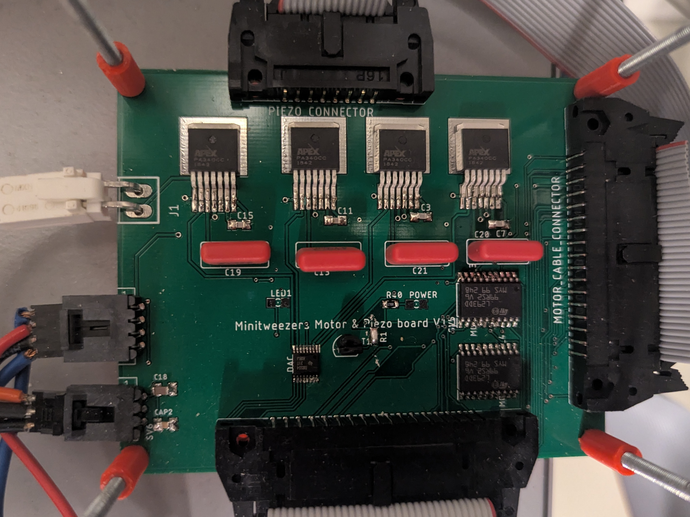
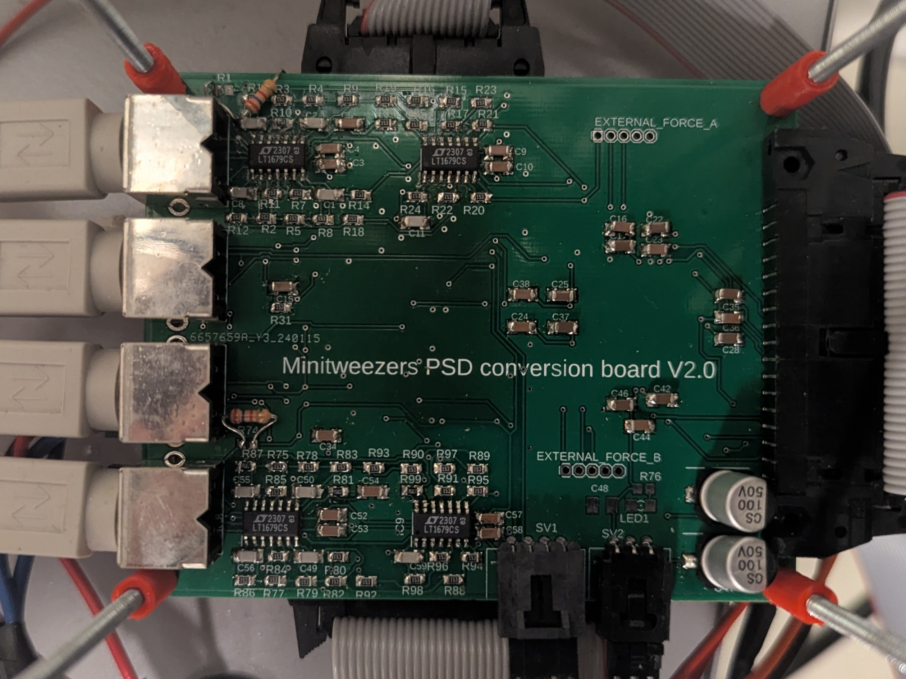
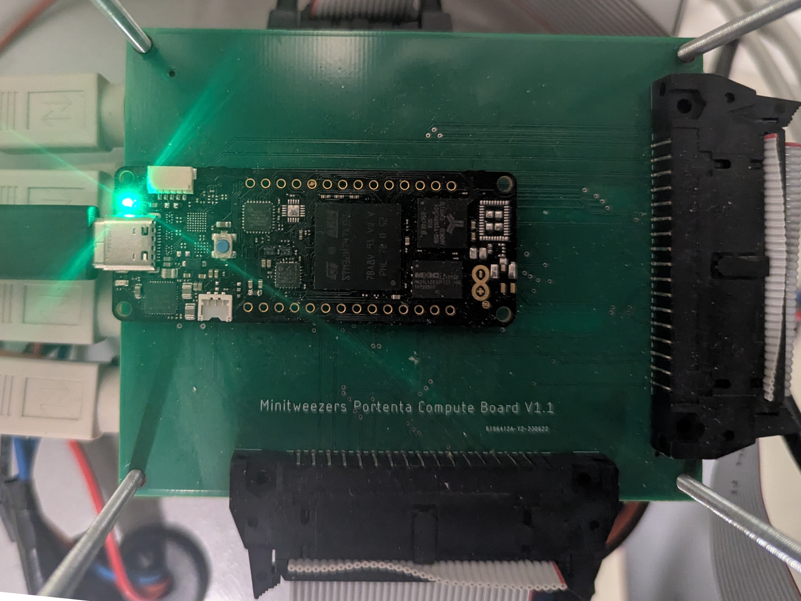

# Electronics of the instrument
Schematics of the controller are in the PDFs found here. Follow the steps below to connect the controller to your instrument and your controller power supply.

## Connecting the controller
To connect the 
### Actuator board
Place this board on the bottom of your controller stack
- Connects to t 3 different power cables from the power supply. The 150 V (for the piezos) the, +- 15V (4 cables connector) and the 5V & 12V (3 cables connector)
- Two ribbon cables to the instrument, one for the motors (34 connectors) and one for the piezos
- Connects to the Main control board with a 34 connector ribbon cable

### Sensor board
Place this board in the middle of your controller stack
- Two power cables power it +- 15V (4 cables connector) and the 5V & 12V (3 cables connector)
- Connects to the instrument with 4 cables, one per set of PSDs, on the short end (left short end in the picture). From top to bottom in the picture these are:
  - Force B
  - Position B
  - Poistion A
  - Force A.

### Microcontroller board
Place this board on top of you controller stack.
- Connect it to the Sensor board and the actuator board using 34 connector ribbon cables. The sensor board connects to the short end of the board and the actuator board to the long end.
- Connect it to the host computer with a USB-C cable attached to the arduino portenta. The ARDUINO should be oriented as in the picture below. It will start blinking green when connected to the computer and the program is running.

