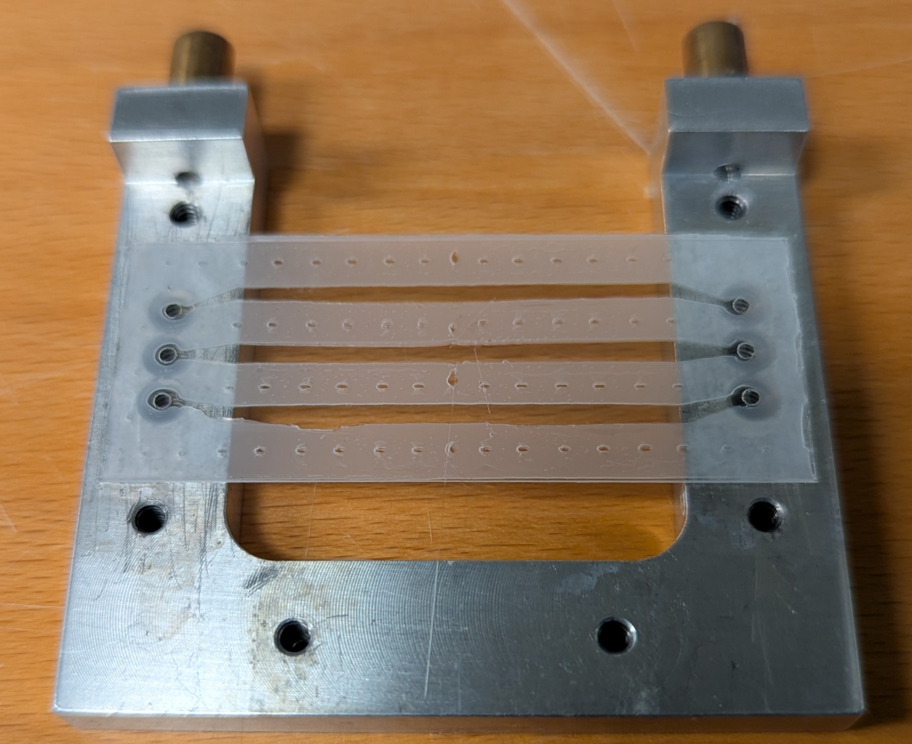
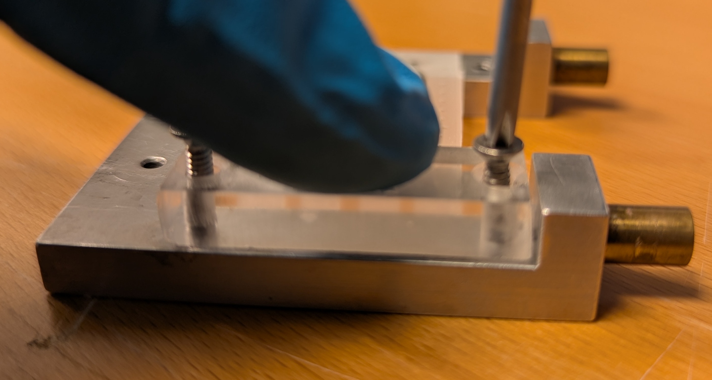
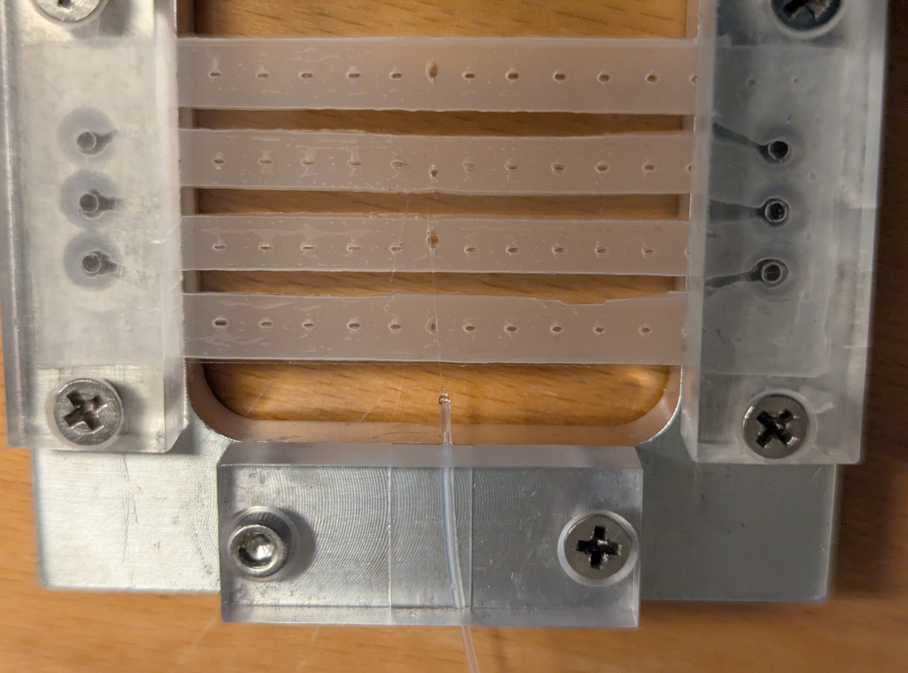

# SmartTrap system


This GitHub page describes the SmartTrap system, including how to assemble and set up your own system.
The system is described in our publication, currently on arXiv: <https://doi.org/10.48550/arXiv.2505.05290> 
The SmartTrap system is capable of running advanced experiments such as, single molecule force spectroscopy, autonomously for over 10 hours. It can automatically trap particles and perform a growing range of measurements. Schematics and software are accessible here making it easy to build you own SmartTrap or adapt parts of it to your own system. 

## Hardware
The SmartTrap system is based on the MiniTweezers optical tweezers instrument, details of which you can find here: <http://tweezerslab.unipr.it/cgi-bin/home.pl>
Here, we provide lists of the components you need to assemble your own system along with guidlines on assembly and installation of the system.

### Components
The components of the system are split into separate units, instrument, electronics controller etc. Files listing the different components are found in the components folder.

### Assembly instructions
The assembly of the instrument is outlined in the [FullAssembly video](<Supplementary Videos/FullAssembly.mp4>). 

## Electronics
The optical tweezers instrument is controlled by a custom electronics controller. This controller consists of 3 separate circuit boards (PCBs) which are connected together via ribbon cables.

### Circuit boards
The 3 circuit boards of the controller are listed below.
- PCB 1 - Microcontroller board: Hosts the microcontroller which is an Arduino Portenta H7. This board is connected to both the other boards and the host computer.
- PCB 2 - Sensor board: This board connects to the various sensors, amplifying and digitizing the signals. Connected to the microcontroller board with a ribbon cable.
- PCB 3 - Actuator board: Connects to the motors and piezo actuators which moves the sample stage as well as the laser positions. Connected to the microcontroller board with a ribbon cable.

The Bill of Materials (BOM) files are in the [components folder](Components/) and the schematics of the boards can be found in [Instrument Schematics folder](<Instrument Schematics/>).

### Firmware
The firmware is the program running on the controller, specifically the microcontroller, to steer it. It needs to be installed for the controller to work. The files can be found in the [Firmware](Firmware/)  on this github page.
To install (flash) the firmware onto the controller do the following.

 - Connect the microcontroller to the host computer. For this use a USB-C cable.
 - Download the [Firmware folder](Firmware/).
 - Open the folder in an arduino IDE. We recommend using Arduinos own IDE which you can find here: <https://www.arduino.cc/en/software/>
 - Under tools select the arduino portenta H7 board and the correct COM port (should show up as Arduino Portenta h7).
 - Compile and upload the firmware by pressing the upload button in the top left corner of the IDE. There are a few extra packages needed to compile the software, if these are not installed the arduino IDE will automatically prompt you to install them.
Once the firmware is correctly uploaded, and the microcontroller is connected to both the controller PCB and the host computer, a green light will be flashing periodically on the microcontroller.

Note that other IDEs, such as Visual Studio Code, are possible to use, but may require a bit more work to set up.

### Controllers and drivers
The SmartTrap system combines a central instrument controller with several independent devices, each with its own hardware controller and corresponding Python driver. All drivers follow a Python protocol, so replacing hardware requires only implementing the correct interface and updating the create_devices function in the smarttrap_config.py file to use your own different device. Further details can be found in the Software folder.

- **Optical tweezers instrument** - The instrument is controlled using the custom controller. This provides also control of the motors, laser movement and sensor readings.
  - Hardware: Custom electronics controller. Controls the motors, laser positioning and reads the various photosensors.
  - Driver: Communicates with the host computer with serial USB. The different subsystems, sample stage motors, laser actuators and photosensors, are each controlled by separate classes allowing them to be easily replaced without replacing the entire controller if need be.
- **Camera** - The camera is monitored directly in the user interface. From the interface one can record videos, note that the camera feed is used in the autonomous protocols.
  - Hardware: Two options currently implemented: Thorlabs scientific cameras and Basler cameras. 
  - Driver: Connects automatically to the camera from the chosen suppliers. Other cameras can be implemented using the interface in camera_controls. The Basler cameras requires the PyPylon package while the Thorlabs cameras require installing the [thorlabs SDK](<https://www.thorlabs.com/software_pages/ViewSoftwarePage.cfm?Code=ThorCam>)
- **Laser power control** - Enables adjusting the power of the two lasers directly from the user interface as well as during autonomous protocols.
  -  Hardware: Uses an OSTech laser diode driver and TEC controller [ds11-la0.5v14-pa02v14-t8545-691](<https://www.ostech.de/en/products/laser-drivers/ds11-t85/691>).
  -  Driver: Uses serial communications, integrated in the OSTech laser.
- **Microfluidics** - The microfluidics is used to deliver particles into the system. It is possible to use manually operated syringes as well, but full digital control is necessary for autonomous procedures.
  - Hardware: Pump and valves used are from [ElveFlow](<https://elveflow.com/>), in particular the OB1 microfluidics pump and the Mux Wire V3 valve controller.
  - Driver: Requires ElveFlows proprietary software as well as the  the [LabView runtime engine](<https://www.ni.com/en/support/downloads/software-products/download.labview-runtime.html?srsltid=AfmBOoqhYo82koPNAGyVOaWM6Thr4NwTCO1KBI9eCecb0INE0mCxeVmB#569345>)
- **Micropipette** The suction of the micropipette can be toggled by activating the pump connected to it.
  - Hardware: Uses a pump powered by a dc motor, D2028B from SparkFun Electronics. This is controlled by a separate power supply, TENMA 72-2540
  - Driver: Python driver with the ability to set the power of the pump and toggle the suction on and off.
- **Motorized objective movement**- This is an optional addition and allows the user to move the objectives from the user interface for adjusting focus.
  - Hardware: Is an arduino UNO. The program for it can be found in the firmware folder.
  - Driver: Python driver communicating using serial USB. Allows for moving the objective in either long or short steps closer to or away from the chamber.
- **Pipette puller** A separate device used to make the micropipettes by heating and pulling on glass microcapillaries.
  - Hardware: Custom desgined, see pipette puller section. Powered by a TENMA 72-2540 power supply.
  - Driver: Runs in a separate graphical user interface in which the parameters of the heating can be tuned to get suitable size of the pipettes.

### Connecting the controllers
Connecting the various controllers is simple. All connect to the host computer using USB. Importantly you will need to configure the softwware to know which COM port is used for which device. This is configured in the smarttrap_config.py by updating the appropriate port, which ports are used can be found in the device manager if you are using a windows pc.

## Main program
The main program runs on the host computer and is used to steer the entire system. It includes a graphical user interface (GUI) and the fully autonomous protocols.

### Installation
To install the main program first download the files in the Software folder of the github. It is recommended to use Anaconda (<https://www.anaconda.com/>) set up a separate python environment for the SmartTrap. The system has been tested on Windows 11, compatability with other operating systems has not been tested.
The software is tested with Python 3.13 as well as a computer running Windows 11 and a CUDA ready graphics card. Older and newer versions of python will likely work if they support the required packages, but have not been extensively tested.
Once a python environment has been created, do the following to install the required packages. 
- Open a terminal in the desired environment.
- Navigate to the target folder with the downloaded files.
- Run the command: "python install_auto.py" to install the required packages.
  - Recommended: Install pytorch with CUDA support,
   - To install cuda on windows <https://docs.nvidia.com/cuda/cuda-installation-guide-microsoft-windows/> Install cuda prior to running the install command to automatically install pytorch with cuda support.

The software needs to know which device is connected to which port. To check this open up the windows device manager to check the COM ports.
Then change in the config.py file and insert the appropriate COM ports to have the software automatically connect to the devices. Note that port numbers can change, for instance if the computer is updated, if this happens just update the config file accordingly.

### Starting the software
Once the installation is complete the program is started from the command prompt with the command:
"python main.py"
This will start the program and open the graphical user interfaces. To run the command ensure that you have the correct python environment and that the command prompt is in the same folder as the software.

### Using the interface
The various controls of the instrument are divided into different by different widgets. These are essentially small windows. The most central ones are described below.

**The main window**

The main window contains the camera view as a central component and most of the different widgets are docked in it by default.
From the main window you can open the different widgets and perform various actions. By selecting the different mouse tools you can use your mouse to directly control the interfaces, by for instance selecting the motors you can click and drag on the screen to move the sample around.

**Protocols widget**

This widget is used to manually specify to the instrument which laser protocol to run. These protocols run on the microcontroller and steers the lasers, for instance moving the optical trap at a fix speed between two different positions.
To set the parameters first write in the values you want and then hit set parameters. You can see the current values of the parameters in the column to the right.
To start a protocol hit the "toggle protocol" button.

**Mouse tools**

There are several different tools you can use with the mouse to interact with the instrument based on what is seen on the camera feed. These tools are found and selected in the top left of the interface. With these you can for instance zoom in the camera view to an area of interest, measure distances, move the lasers and move the sample stage by clikcing and dragging.

**Plotting**

To plot and monitor signals, such as the forces, open a plotting window by opening the "windows" drop down menu and selecting "live plotter".
This will open the default plotting tool which plots the force along the y-axis as function of time. To change which signals are plotted click "plot 1" in the plot window to open the plot options menu. There you can find x-data and y-data. Click these to select which signal to plot on the y-axis and which to plot on the x-axis.
You can add more separate plots by clicking the "add plot" button.

There are also several plot presets which you can select directly from the windows dropdown menu in the main interfaces. These are; force PSDs, positions PSDs and force-distance X and Y. 

It is possible to export both data and graphs directly from the plotting windows. To do this right click on the plot and select the export option.

**Recording data**

To record data hit the record data button at the top right corner of the interface. It turns green automatically when data is recording.
Likewise, to record videos, hit the record video at the top left of the screen. 
You can select where to save the data by using the file drop down menu and selecting the "save data path" option. Under the "file" menu you can also select the format of videos, images and the data saved.

**Motorized stage movement**

There are two primary methods for moving the motors manually. You can use the mouse tool to move the motors by clicking and dragging, or you can use the motor control widget. From this widget you can move in your specified direction at a specific speed. The movement speed can be set by typing the desired movement speed in the entry bar or selecting one of the preset speeds.

Under the actions tab at the top of the interface you can save positions in the chamber, when you do this you also name the position. You find also the "go to saved position" option in the actions tab which lets you move to one of the saved positions.

**Laser movement**

You can manually control the laser movement from the laser movement widget. To do this use the sliders. There are 4 sliders, one per laser and axis. The sliders will also move if there is a protocol running indiciating how the lasers move. From this widget you can toggle the automatic laser alignment.

**Autonomous control**

To monitor and toggle the various autonomous protocols use the autocontroller widget. This is opened from the windows drop down menu. With the autocontroller widget you can both monitor and toggle the various autonomous protocols and use some of the autonomous subroutines (e.g. putting a particle in the pipette).

#### Testing the software

You can run the interface also without any of the devices connected. To do this follow the instructions to start the software, but add the extra argument -testmode by running the command:
"python main.py -testmode"
This will create testdrivers for the different devices which act similarily to the real devices from a software perspective, but are not connected to any physical hardware.
These testdriverds can also be used to test the functionality of just one or two devices separately from the rest of the system during development.

### Autonomous control
There are various autonomous protocols that the instrument can execute.
You can choose to run entire experiments, such as a single molecule force spectroscopy. Alternatively you can run just one of the subroutines, such as the automatic trapping.

### Neural networks
The weight of the networks needed for the automation are stored in the folder /NeuralNetworks and the weights of a pretrained network are available in the file YOLOV5Weights.pt. 
Note that other custom trained networks can be loaded directly from the user interface. 

# Expanding on the software
The software provided here is open source and as such you are free to download and modify it to your own needs.

## Adapting the software to other systems
The software suit, and in particular the interface and its back end, has been designed with the use in other system and experimental procedures in mind. 
The different protocols of the various devices simply needs to be implemented and then you need to adapt the create_devices function in config.py to ensure that your specific device is used.

## Making a sample chamber
The sample chambers used in the SmartTrap are handmade. You can make your own chambers by following the instructions below.

### Items needed
 To make a microfluidics chamber the following is needed. Below are also instructions on how to prepare the parafilm and the glass slides.
 **Tools**:
- Laser cutter
- Hotplate
- Pipette puller
- Scalpel
- Tweezers

**Consumables**:
- Parafilm
- Coverglass slides, thickness 1.5 , 60x24 mm
- Micropipette
- Channel capillaries

Note that both the parafilm and the holes in the coverglasses can be cut with a lasercutter. 

**Cutting parafilm**
First prepare the parafilm by cutting it with the laser cutter. To do this place it stretched horisontally on the laser cutter with the paper peeled off. 
You can for instance use the nescofilm roller from the tweezerlab website <http://tweezerslab.unipr.it/cgi-bin/assemblies.pl/Show?_id=ddd9> for this.

Load the pattern into the laser cutter and position it on the parafilm.
The settings of the laser cutter will depend on the model used. We use vector engraving at ca 50% of max power.

**Preparing the holes of the glass slides**
To make holes in the glass slides you can either use glass drill or a laser cutter.
The optimal settings will depend on the model of the laser cutter. Recommended is to use multiple repetitions.
If you instead use a drill carefully check that all the holes are placed in the correct position.

### Assembling a chamber
To assemble a chamber from the prepared material perform the following steps:

1. Use a scalpel to cut two pieces of parafilm free.  
   

2. Gently peel away the parafilm covering the channels using the tweezers.

3. Place the parafilm on top of a glass slide with the holes aligned on both sides as per picture.  
   

4. At this point prepare the pipette following these steps:
   1. Place a single glass capillary centered in the pipette puller.
   2. Gently tighten the four screws to clamp the pipette tight.  
      
   3. Carefully raise the pipette puller to a standing position.
   4. Toggle the pipette pulling protocol in the pipette puller program. [Watch demo video](<Supplementary Videos/pipette pulling.mp4>)
     NOTE: When a pipette is pulled two sharp ends are made, only the bottom part is used since the top is most often closed up completely. Therefore it needs to be cut off if the same capillary is used to make multiple pipettes. 

5. Next, place the micropipette in the center of the chamber and the capillaries next to it. Pipette and the capillary openings should be near the central chamber’s center as shown in the picture.  
   

6. Place the second sheet of parafilm on top of the first and align it carefully. Be careful not to move the pipette or the capillaries out of place when doing this.  
   

7. Place a coverslip without holes on top and align it with the bottom slide.

8. Cut away any excess parafilm.  
   

9. Heat the chamber for ~4 minutes at 110 °C on the hotplate with a weight of ~400 g applied.

10. It is recommended to sandwich the chamber between two thicker glass slides for more even weight distribution.

11. Remove the chamber and let it cool off.

### Installing a chamber
To install a chamber first take the sample holder from the system and remove the clamps before starting assembly.

1. Align the chamber with the holder, ensuring that the holes of the chamber are centered at the holes of the holder. 
2. Gently mount the two chamber clamps. Keep a finger on the clamp while screwing to ensure an even pressure distribution. 
3. Put the pipette clamp into position and screw the screws halfway in.
4. Put the pipette tubing under the clamp and thread the tubing around the pipette itself. Be careful so as not to break the pipette. Leave ca 5 mm of space betewen the top of the tubing and the chamber bottom.
5. Tighten the pipette clamp.
6. Add a drop UV-glue to the tip of the tubing. You should be able to see a small amount of glue entering a few millimeters into the tubing. 
7. Cure the UV-glue using a UV-lamp.
8. Install the microfluidics screw connectors.
9. Connect the microfluidics tubing. Make sure the flow is directed so that the capillaries in the correct direction....
10. Flow buffer into the chamber and make sure there are no bubbles. If there are bubbles in the chamber try to remove them by briefly increasing the flow.
11. If the flow looks good, add a drop of water to the objectives of the system, push the objectives apart and put the chamber in its position as shown.

## Pipette puller
When making chambers you need a micropipette. You can make these yourself from glass capillaries using the pipette puller described here. 

### Puller assembly
Assembly instructions and list of components available in [PipettePuller](<Components/PipettePuller/>).
The puller consists of a metal base with two rods along which the pipette holder can slide.
A platina wire is heated using resistive heating to heat up the capillary and melt it.

### Using the pipette puller
To use the pipette puller first mount a glass capillary in it and connect the cables to the power supply (does not matter which cable goes where since it uses resistive heating). 
Then start the puller software by navigating to the correct folder and running the command "python pipette_puller.py". This will open up a small interface from which you can control the power supply and thereby the pipette puller heating.
The heating protocol is run by hitting the start protocol button. This will start the heating. 

The parameters used for the pulling may need to be tuned to optimize the shape of the pipette. In general, the faster the pulling the smaller the pipette opening (and the longer the larger the opening). Increasing the maximum allowed current of the puller will decrease the pulling time.

# Supplementary Videos
The /Supplementary Videos folder contains 5 videos which showcase the capabilites of the SmartTrap system.

# License
This project is licensed under the MIT License - see the LICENSE file for details.

# Cite us!
You can find more information in our paper:
<https://doi.org/10.48550/arXiv.2505.05290>
```
Martin Selin, Antonio Ciarlo, Giuseppe Pesce, Lars Bengtsson, Joan
Camunas-Soler, Vinoth Sundar Rajan, Fredrik Westerlund, L. Marcus Wil-
helmsson, Isabel Pastor, Felix Ritort, Steven B. Smith, Carlos Bustamante,
and Giovanni Volpe. SmartTrap: Automated Precision Experiments with
Optical Tweezers, May 2025. arXiv:2505.05290 [physics]
```
