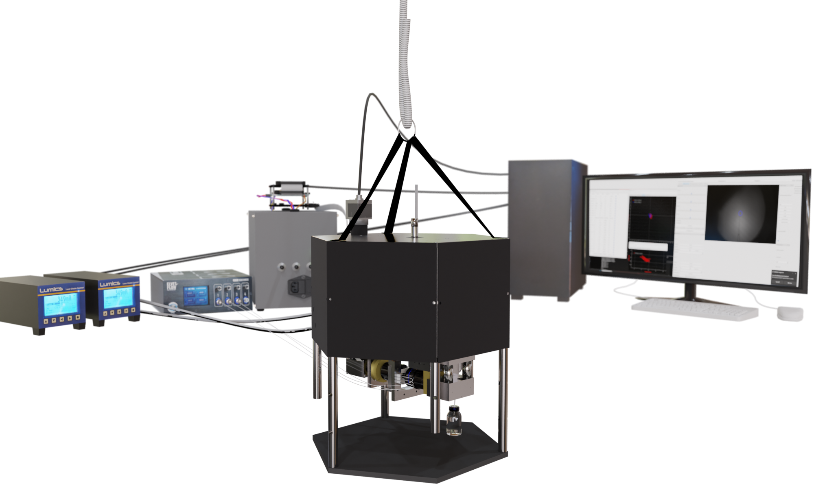
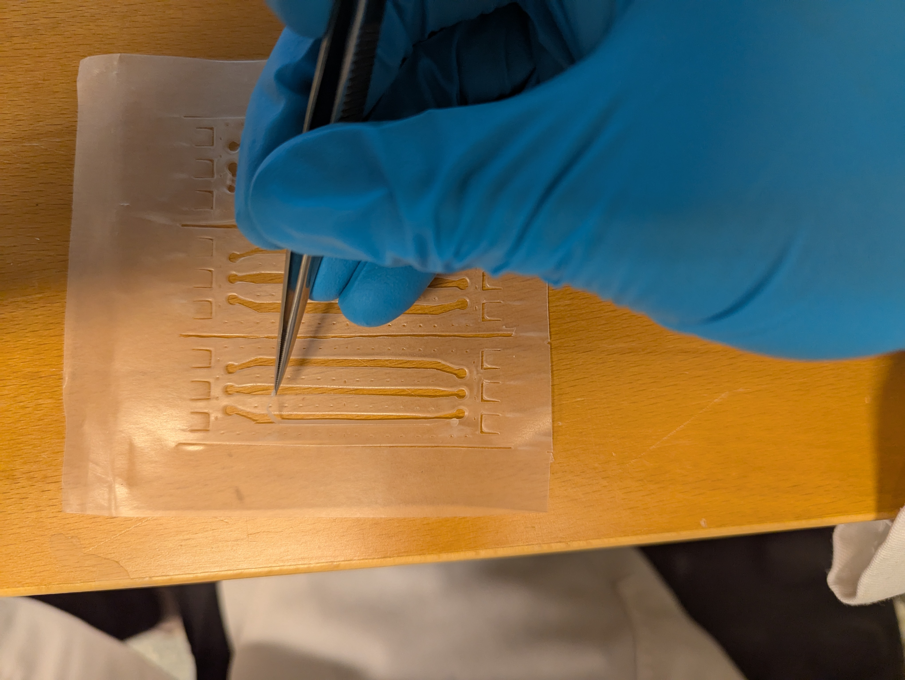
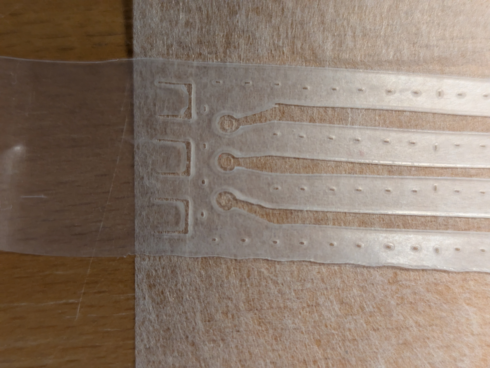
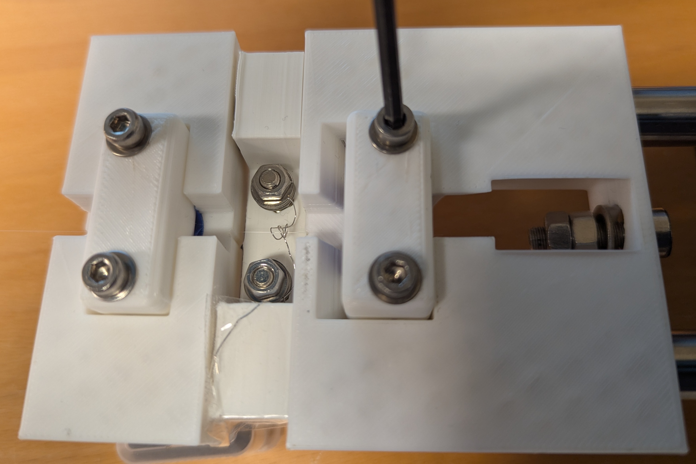
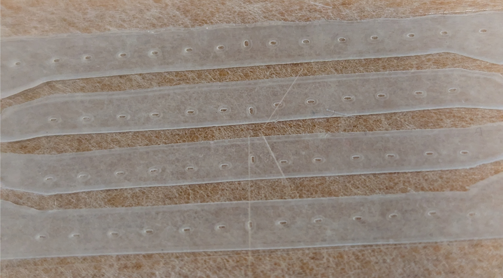
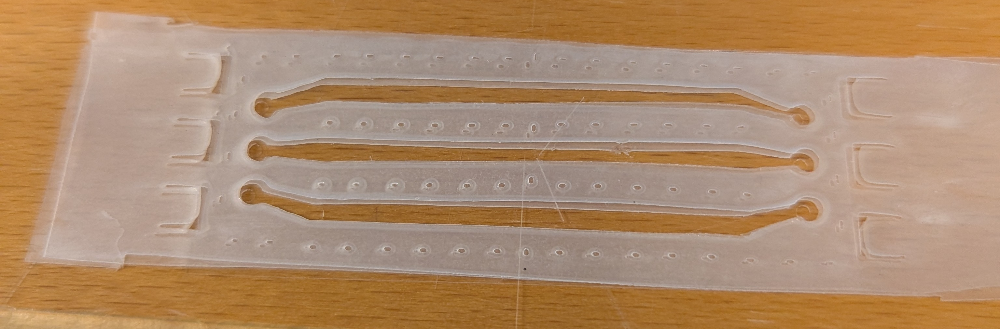
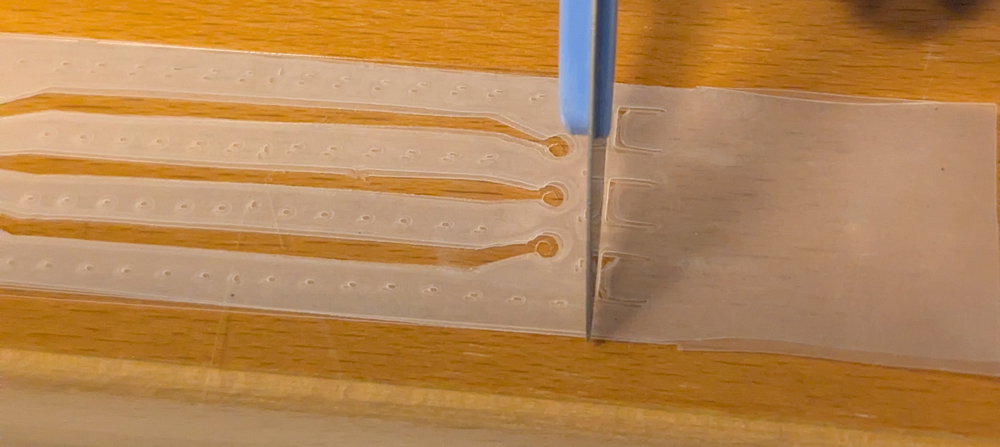

# SmartTrap system



This GitHub page describes the SmartTrap system, including how to assemble and set up your own system.
The system is described in our publication: <https://doi.org/10.48550/arXiv.2505.05290>

## Hardware
The SmartTrap system is based on the MiniTweezers optical tweezers instrument, details of which you can find here: <http://tweezerslab.unipr.it/cgi-bin/home.pl>

Below we provide lists of the components you need to assemble your own system along with guidlines on assembly and installation of the system.
### Components
The components of the system are split into separate units.

### Schematics and custom mechanical components.

### Assembly instructions
To assemble the instrument ...

## Electronics
The optical tweezers instrument is controlled by a custom electronics controller. This controller consists of 3 separate circuit boards (PCBs) which are connected together via ribbon cables.

### Circuit boards
The 3 circuit boards of the controller are listed below.
- PCB 1 - Microcontroller board: Hosts the microcontroller which is an Arduino Portenta H7. This board is connected to both the other boards and the host computer.
- PCB 2 - Sensor board:
- PCB 3 - Actuator board:

The Bill of Materials (BOM) files are in the [components folder](Components/) and the schematics of the boards can be found in [Instrument Schematics folder](<Instrument Schematics/>).

### Firmware
The firmware is the program running on the controller, specifically the microcontroller, to steer it. It needs to be installed for the controller to work and it can be found in the folder Fimrware on this github page.
To install (flash) the firmware onto the controller do the following.

 - Connect the microcontroller to the host computer. For this use a USB-C cable.
 - Download the [Firmware folder](Firmware/) .
 - Open the folder in the arduino IDE. Arduinos IDE which you can find here: <https://www.arduino.cc/en/software/>
 - Under tools select the arduino portenta H7 board and the correct COM port (should show up as Arduino Portenta )
 - Compile and upload the firmware by pressing the upload button in the top left corner of the IDE.
Once the firmware is correctly uploaded, and the microcontroller is connected to both the controller PCB and the host computer, a green light will be flashing periodically on the microcontroller.

Note: also other IDEs, such as Visual Studio Code, are possible to use but may require a bit more work to set up.

### Separate controllers
Not all the components of the SmartTrap are controlled directly by the electronics controller used for the tweezers instrument. Listed below are the separate controllers are used. All have interfaces in the python GUI which can be used to instead use your own other controllers with minimal changes
- Laser power control: 
- Microfluidics: Pump and valves used are from [ElveFlow](<https://elveflow.com/>), in particular the OB1 microfluidics pump and the Mux Wire V3 valve controller. Links:
- Micropipette: Uses a pump powerd by a dc motor. This is controlled by a separate power supply, TENMA 72-2540, same power supply as the pipette puller use.
- Motorized objective movement: This is an optional addition and allows the user to move the objectives from the user interface for adjusting focus. Is an arduino UNO. The program for it can be found in the firmware folder.
- Pipette puller: Powered by a TENMA 72-2540 power supply.

### Drivers
Each component comes with a python driver class. These drivers are used to communicate between the device and the main program.
The drivers each implements a python protocol. To replace the driver, create a class implementing the corresponding protocol and change the import in the main interface.

- Camera
 - Two options currently implemented: Thorlabs scientific cameras and Basler cameras. Thorlabs cameras require installing [thorlabs SDK](<https://www.thorlabs.com/software_pages/ViewSoftwarePage.cfm?Code=ThorCam>)
- Optical tweezers instrument
 - Motors
 - Laser movement
 - Instrument communications
- Microfluidics pump
 - OB1 controller from elvesys, requires the LabView runtime engine <https://www.ni.com/en/support/downloads/software-products/download.labview-runtime.html?srsltid=AfmBOoqhYo82koPNAGyVOaWM6Thr4NwTCO1KBI9eCecb0INE0mCxeVmB#569345>
- Microfluidics valves
 - from elvesys
- Pipette pump
 - D2028B from SparkFun Electronics.

### Connecting the controllers
— video showing the addition of the electronics (and possibly the unit testing and examples?)

## Main program
The main program runs on the host computer and is used to steer the different devices.
It includes a graphical user interface (GUI) and the fully autonomous protocols.

### Installation
To install the main program first download the files in the Software folder of the github. It is recommended to use Anaconda (<https://www.anaconda.com/>) set up a separate python environment for the SmartTrap.
The software is tested with Python 3.13 as well as a computer running Windows 11 and a CUDA ready graphics card. Older and newer versions of python will likely work if they support the required packages, but have not been extensively tested.
Once a python environment has been created, do the following to install the required packages. 
- Open a terminal in the desired environment
- Navigate to the target folder with the downloaded files
- Run the command: "python install_auto.py" to install the required packages
  - Recommended: Install pytorch with CUDA support,
   - To install cuda on windows <https://docs.nvidia.com/cuda/cuda-installation-guide-microsoft-windows/> Install cuda prior to running the install command to automatically install pytorch with cuda support.

The software needs to know which device is connected to which port. To configure this open up the windows device manager to check the COM ports.
Then change in the config file and insert the appropriate COM ports to have the software automatically connect to the devices. Note that port numbers can change if for instance the computer is updated, if that happens just update the config file accordingly.

### Starting the software
Once the installation is complete the program is run from the command prompt with the command:
"python main.py"
This will start the program and open the graphical user interfaces.

### Using the interface
The various controls of the instrument are divided into different by different widgets. These are essentially small windows. The most central ones are described below.

**The main window**
The main window contains the camera view as a central component and most of the different widgets are docked in it by default.

From the main window you can open the different widgets and perform various actions.

By selecting the different mouse tools you can use your mouse to directly control the interfaces, by for instance selecting the motors you can click and drag on the screen to move the sample around.

**Protocols widget**

This widget is used to manually specify to the instrument which laser protocol to run. These protocols run on the microcontroller and steers the lasers, for instance moving the optical trap at a fix speed between two different positions.

**Plotting**

To plot and monitor signals, such as the forces, open a plotting window by opening the "windows" drop down menu and selecting "live plotter".
This will open the default plotting tool which plots the force along the y-axis as function of time. To change which signals are plotted click "plot 1" in the plot window to open the plot options menu. There you can find x-data and y-data. Click these to select which signal to plot on the y-axis and which to plot on the x-axis.
You can add more separate plots by clicking the "add plot" button.

There are also several plot presets which you can select directly from the windows dropdown menu in the main interfaces. These are; force PSDs, positions PSDs and force-distance X and Y.

#### Testing the software
You can run the interface also without any of the devices connected. To do this follow the instructions to start the software, but add the extra argument -testmode by running the command:
"python main.py -testmode"
This will create testdrivers for the different devices which act similarily to the real devices from a software perspective, but are not connected to any physical hardware.
These testdriverds can also be used to test the functionality of just one or two devices separately from the rest of the system during development.

### Autonomous control
There are various autonomous protocols that the instrument can execute.
You can choose to run entire experiments, such as a single molecule force spectroscopy. Alternatively you can run just one of the subroutines, such as the automatic trapping.

### Neural networks
The weight of the networks needed for the automation are stored in the folder /NeuralNetworks and the weights of a pretrained network are available in the file YOLOV5Weights.pt. 
Note that other custom trained networks can be loaded directly from the user interface. 

# Expanding on the software
The software provided here is open source and as such you are free to download and modify it to your own needs.

## Adapting the software to other systems
The software suit, and in particular the interface and its back end, has been designed with the use in other system and experimental procedures in mind. 
The different protocols of the various devices simply needs to be implemented.

## Making a sample chamber
The sample chambers used in the SmartTrap are handmade.

### Items needed
 **Tools**:
- Laser cutter
- Hotplate
- Pipette puller
 - List of components available in the components list
- Scalpel
- Tweezers

**Consumables**:
- Parafilm
- Coverglass slides, thickness 1.5 , 60x24 mm
- Micropipette
- Channel capillaries

Note that both the parafilm and the holes in the coverglasses can be cut with a lasercutter.

**Cutting parafilm**
First prepare the parafilm by cutting it with the laser cutter. To do this place it stretched horisontally on the laser cutter with the paper peeled off. 
You can for instance use the nescofilm roller from the tweezerlab website <http://tweezerslab.unipr.it/cgi-bin/assemblies.pl/Show?_id=ddd9> for this.

Load the pattern into the laser cutter and position it on the parafilm.
The settings of the laser cutter will depend on the model used. We use vector engraving at ca 20% of max power.

**Preparing the holes of the glass slides**
To make holes in the glass slides you can either use glass drill or a laser cutter.
The optimal settings will again depend on the model of the laser cutter. Recommended is to use multiple repetitions.
If you instead use a drill carefully check that all the holes are placed in the correct position.

### Assembling a chamber
To assemble a chamber from the prepared material perform the following steps:

1. Use a scalpel to cut two pieces of parafilm free.  
   

2. Gently peel away the parafilm covering the channels using the tweezers.

3. Place the parafilm on top of a glass slide with the holes aligned on both sides as per picture.  
   

4. At this point prepare the pipette following these steps:
   1. Place a single glass capillary centered in the pipette puller.
   2. Gently tighten the four screws to clamp the pipette tight.  
      
   3. Carefully raise the pipette puller to a standing position.
   4. Toggle the pipette pulling protocol in the pipette puller program. [Watch demo video](<Supplementary Videos/pipette pulling.mp4>)

5. Next, place the micropipette in the center of the chamber and the capillaries next to it. Pipette and the capillary openings should be near the central chamber’s center as shown in the picture.  
   

6. Place the second sheet of parafilm on top of the first and align it carefully. Be careful not to move the pipette or the capillaries out of place when doing this.  
   

7. Place a coverslip without holes on top and align it with the bottom slide.

8. Cut away any excess parafilm.  
   

9. Heat the chamber for ~4 minutes at 110 °C on the hotplate with a weight of ~400 g applied.

10. It is recommended to sandwich the chamber between two thicker glass slides for more even weight distribution.

11. Remove the chamber and let it cool off.

### Installing a chamber
To install a chamber first take the sample holder from the 

## Pipette puller
When making chambers you need a micropipette. You can make these yourself from glass capillaries using the pipette puller described here. 

### Puller assembly
The puller consists of a metal base with two rods along which the pipette holder can slide.
A platina wire is heated using resistive heating to heat up the capillary and melt it.

The components needed and , are listed in the pipette puller components [list](<Components/PipettePuller/PipettePullerComponents.xlsx>).

### Using the puller
To use the pipette puller first mount a glass capillary in it and connect the cables to the power supply (does not matter which cable goes were). 
Then start the puller software by navigating to the correct folder and running the command "python pipette_puller.py". This will open up a small interface from which you can control the power supply and thereby the pipette puller heating.
The program is run by hitting the run button. This will start the heating. 

The parameters used for the pulling may need to be tuned to optimize the shape of the pipette. In general, the faster the pulling the smaller the pipette opening (and the longer the larger the opening). Increasing the maximum allowed current of the puller will decrease the pulling time.

# Supplementary Videos
The /Supplementary Videos folder contains 5 videos which showcase the capabilites of the SmartTrap system.

# Cite us!
You can find more information in our paper:
<https://doi.org/10.48550/arXiv.2505.05290>
```
Martin Selin, Antonio Ciarlo, Giuseppe Pesce, Lars Bengtsson, Joan
Camunas-Soler, Vinoth Sundar Rajan, Fredrik Westerlund, L. Marcus Wil-
helmsson, Isabel Pastor, Felix Ritort, Steven B. Smith, Carlos Bustamante,
and Giovanni Volpe. SmartTrap: Automated Precision Experiments with
Optical Tweezers, May 2025. arXiv:2505.05290 [physics]
```
